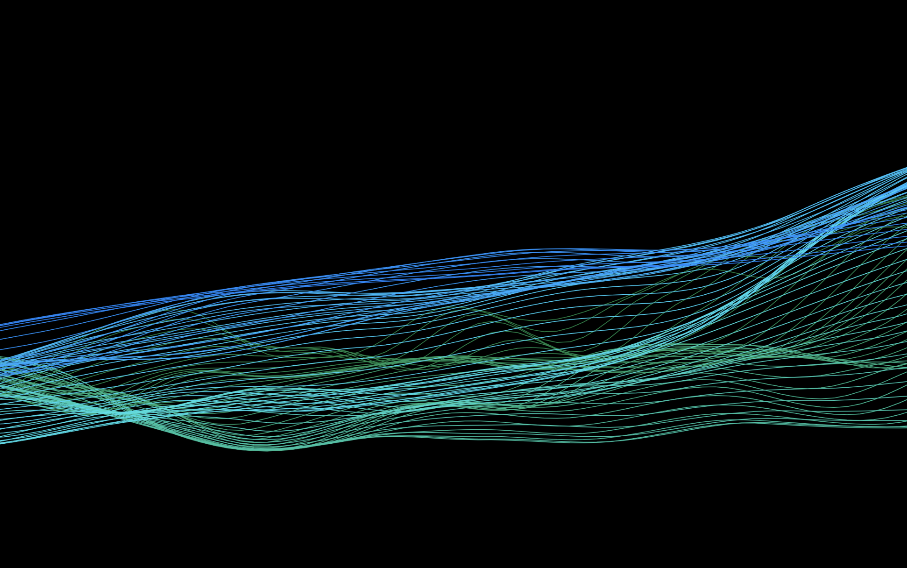

# P5によるクリエイティブコーディング用リポジトリ

例.ノイズ

## MathArtとは
数学的な考え方を適用し、表現のためのプログラムを記述する手法のこと

### MathArtの大家
- レオナルド・ダ・ヴィンチ
- サルバドール・ダリ
- マウリッツ・エッシャー

### MathArtで用いる数学的理論とその分野
- 基礎
  - 黄金比
  - フィボナッチ比
- 幾何
  - トポロジー
  - タイリング
    - フォーデンベルクのタイル
    - ロビンソンタイリング
    - ペンローズタイリング
    - トルシェタイリング
- ストリングアート
  - 曼荼羅
  - 螺旋
    - アルキメデス螺旋
    - ベルヌーイ螺旋
    - クロソイド曲線
  - サイクロイド
    - エピサイクロイド
    - ハイポサイクロイド
  - スピログラフ
  - トロコイド曲線
  - リサージュ曲線
- フラクタル
  - シェルピンスキーのギャスケットとカーペット
  - パスカルの三角形
  - デラノイの三角形
  - ドラゴン曲線
  - リンデンマイヤーシステム
  - ランダムウォーク
  - レヴィのダスト
- カオスアート
  - クリフォードアトラクター
  - デヨンアトラクター
  - ホパロンアトラクター
  - ローレンツアトラクター
  - グモウスキーアトラクター